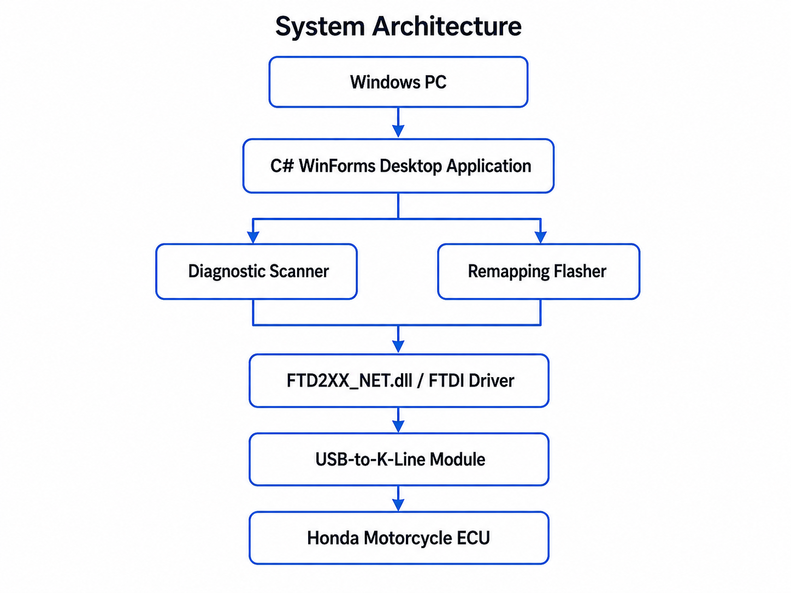
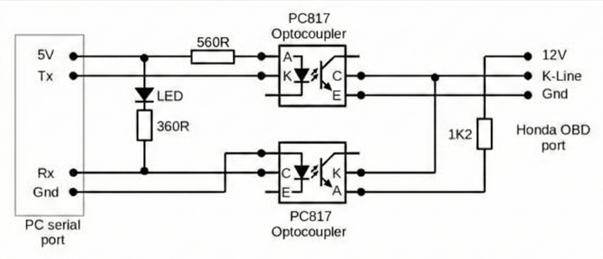
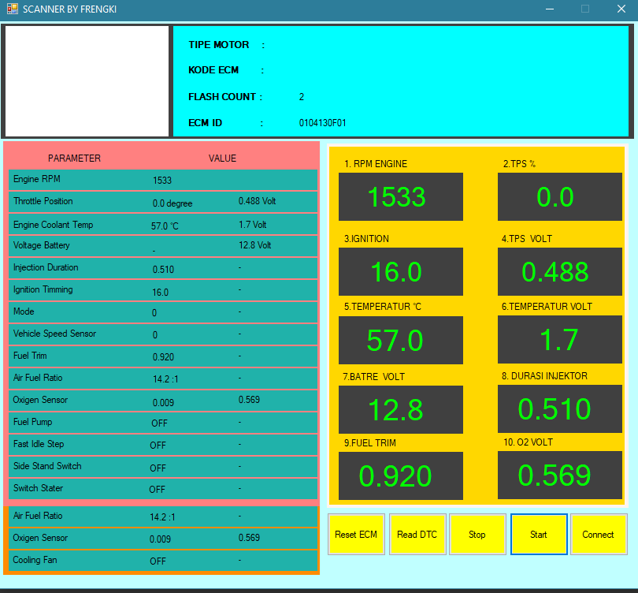
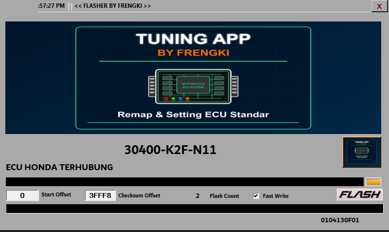
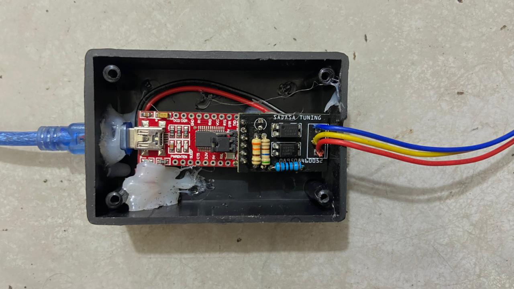
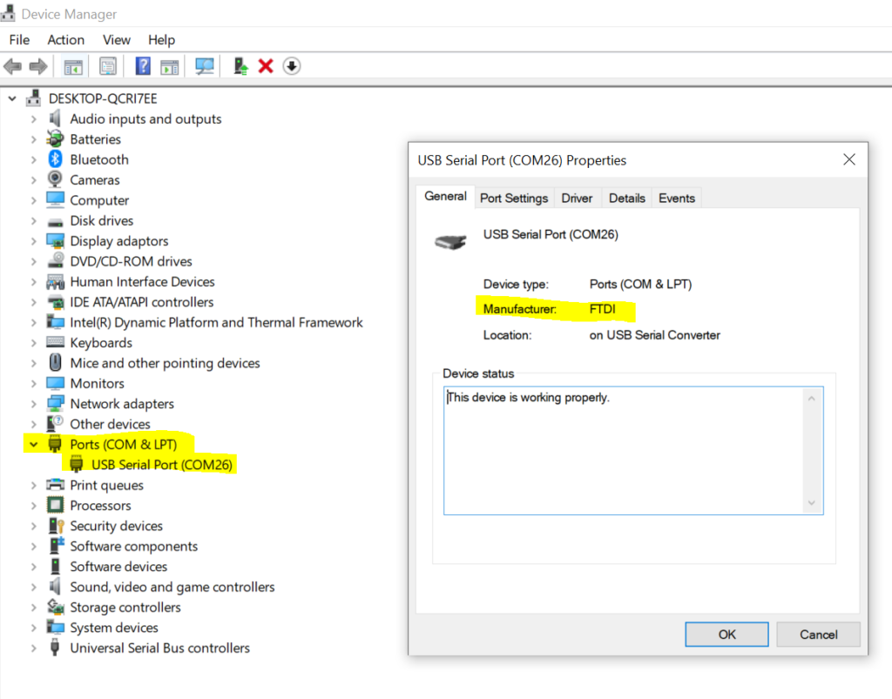

# ECU Diagnostic & Remapping Desktop Application


## Live Portfolio

**Website:** [https://ecu-diagnostic-remapping.frengkipurba.com](https://ecu-diagnostic-remapping.frengkipurba.com)

---

## Project Overview

**ECU Diagnostic & Remapping Desktop Application** is a Windows desktop engineering project designed to support Honda motorcycle ECU diagnostic and remapping workflows.

The project includes two main desktop tools:

1. **Diagnostic Scanner**  
   Used for ECU diagnostic workflow, communication checking, and diagnostic reading.

2. **Remapping Flasher**  
   Used for BIN file selection, file validation workflow, and controlled ECU remapping/flashing process.

This repository presents the project as a portfolio-ready desktop engineering application with screenshots, video walkthrough, documentation, downloadable application package, and safety disclaimer.

---

## Key Features

- Windows desktop application for ECU diagnostic and remapping workflow.
- Separate **Scanner** and **Flasher** application flows.
- FTDI dependency through `FTD2XX_NET.dll`.
- USB-to-K-Line hardware integration workflow.
- Honda motorcycle ECU communication workflow.
- Downloadable application package for recruiter or technical review.
- Screenshot documentation for UI, hardware, and architecture overview.
- Video walkthrough for visual project presentation.
- Safety disclaimer and local setup documentation included.

---

## Technology Stack

| Area | Technology / Component |
|---|---|
| Programming Language | C# |
| Desktop Framework | .NET Windows Forms / WinForms-style application |
| Platform | Windows Desktop |
| Communication Dependency | FTDI / `FTD2XX_NET.dll` |
| Hardware Interface | FTDI USB Interface |
| ECU Interface | USB-to-K-Line Module |
| Target Workflow | Honda Motorcycle ECU Diagnostic & Remapping |
| Portfolio Hosting | Static HTML website |

---

## Repository Structure

```text
ecu-diagnostic-remapping/
├── README.md
├── DISCLAIMER.md
├── app/
│   ├── SCANNER BY FRENGKI.exe
│   ├── FLASHER BY FRENGKI.exe
│   └── FTD2XX_NET.dll
├── screenshots/
│   ├── architecture-diagram.png
│   ├── flasher-ui.PNG
│   ├── ftdi-device-manager.png
│   ├── hardware-module.jpeg
│   ├── module-framework.png
│   └── scanner-ui.PNG
├── video/
│   └── ecu-diagnostic-remapping-walkthrough.mp4
├── docs/
├── data/
└── download-package/
    └── ecu-diagnostic-remapping.zip
```

---

## Application Files

The desktop application files are located in the `app/` folder:

```text
app/
├── SCANNER BY FRENGKI.exe
├── FLASHER BY FRENGKI.exe
└── FTD2XX_NET.dll
```

| File | Purpose |
|---|---|
| `SCANNER BY FRENGKI.exe` | Diagnostic scanner application for ECU communication and diagnostic workflow. |
| `FLASHER BY FRENGKI.exe` | Remapping/flasher application for BIN selection and controlled flashing workflow. |
| `FTD2XX_NET.dll` | Required FTDI communication dependency. |

---

## Screenshots

### System Architecture / Arsitektur Sistem



### Module Framework / Framework Modul



### Diagnostic Scanner UI



### Remapping Flasher UI



### Hardware Module



### FTDI Device Manager



---

## Video Walkthrough

The project walkthrough video is available in the `video/` folder:

[Watch ECU Diagnostic & Remapping Walkthrough](video/ecu-diagnostic-remapping-walkthrough.mp4)

```text
video/
└── ecu-diagnostic-remapping-walkthrough.mp4
```

If GitHub opens the video as a downloadable file instead of playing it directly, please use the live portfolio website:

[https://ecu-diagnostic-remapping.frengkipurba.com](https://ecu-diagnostic-remapping.frengkipurba.com)

---

## System Architecture / Arsitektur Sistem


---

## Diagnostic Scanner Workflow

1. Open the Scanner application.
2. Ensure the FTDI device and driver are available.
3. Connect the hardware interface to the ECU.
4. Start ECU communication.
5. Read diagnostic information or communication status.
6. Use the scanner result as a validation step before or after remapping.

---

## Remapping Flasher Workflow

1. Open the Flasher application.
2. Check FTDI and hardware readiness.
3. Select the compatible BIN file.
4. Perform file validation workflow.
5. Confirm wiring, ECU connection, and stable power condition.
6. Run the controlled remapping/flashing workflow.
7. Verify the result using the Diagnostic Scanner.

---

## Local Setup

### Requirements

- Windows laptop or PC.
- Compatible .NET Framework runtime.
- FTDI driver installed.
- FTDI USB interface.
- USB-to-K-Line module.
- Compatible Honda motorcycle ECU for full functionality.
- Stable 12V power source for ECU-related operation.

### How to Run

1. Download or clone this repository.
2. Open the `app/` folder.
3. Make sure these files are in the same folder:

```text
SCANNER BY FRENGKI.exe
FLASHER BY FRENGKI.exe
FTD2XX_NET.dll
```

4. Run the Scanner application first.
5. Run the Flasher application only with proper hardware, wiring, and safety preparation.

---

## Download Application Package

The downloadable package is available in:

```text
download-package/ecu-diagnostic-remapping.zip
```

It contains the application files, required DLL, selected screenshots, documentation, and safety notes for portfolio/recruiter review.

---

## Documentation

Supporting documentation is available in the `docs/` folder, including:

- User guide PDF.
- Case study documents.
- Local setup notes.
- Recruiter view documentation.
- Security cleanup notes.

---

## Safety Disclaimer

This project is shared for portfolio and technical review purposes.

ECU diagnostic and remapping activities involve technical risk. Incorrect wiring, unstable power supply, incompatible ECU files, or improper flashing procedures may cause ECU malfunction, vehicle issues, or hardware damage.

The following sensitive materials are not included:

- Original ECU BIN files.
- XDF/map definition files.
- ECU backup files.
- Source code private implementation.
- Checksum logic.
- Seed/key logic.
- Sensitive flashing implementation details.

Please read [`DISCLAIMER.md`](DISCLAIMER.md) before using or reviewing the application package.

---

## Result

This project demonstrates:

- Windows desktop engineering capability.
- C#/.NET WinForms-style application development.
- Hardware-software integration.
- FTDI dependency handling.
- ECU diagnostic and remapping workflow understanding.
- Technical documentation and recruiter-ready portfolio packaging.

---

## Limitation

- Windows-only desktop application.
- Full functionality requires ECU/FTDI/USB-to-K-Line hardware.
- No complete standalone simulation mode is provided.
- Remapping/flashing workflow should only be performed with correct technical knowledge and safety preparation.
- Public repository is intended for portfolio presentation, not as a universal ECU flashing solution.

---

## Positioning

This project is positioned as a **desktop engineering portfolio project** that highlights practical software-hardware integration, ECU workflow understanding, and technical documentation readiness.

